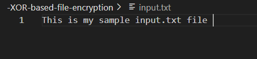
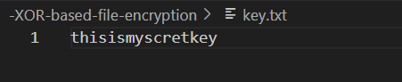
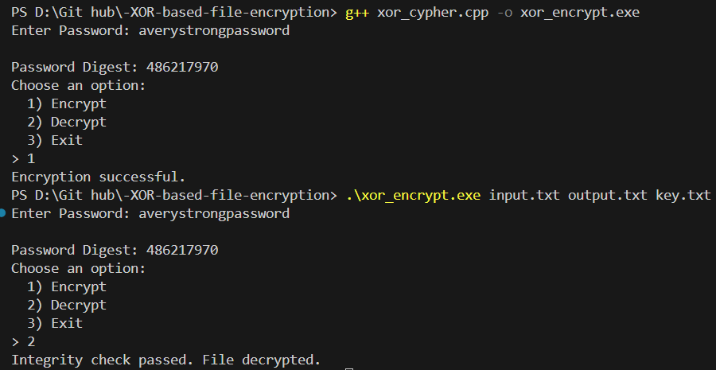
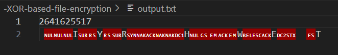
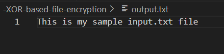
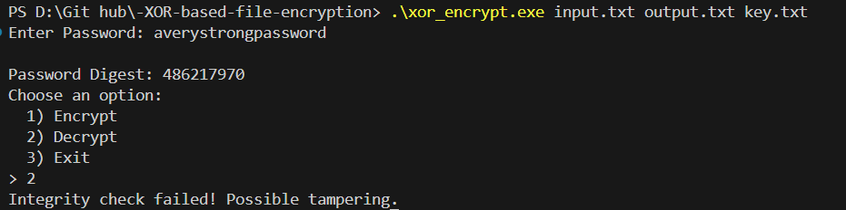

# -XOR-based-file-encryption 

### About  
It’s a simple command-line tool that takes an input file, encrypts or decrypts it, and saves the output.  

---

### 📂 Project Structure  
```
MyCipherProject/
├── xor_encrypt.exe        # Compiles the project
├── xor_cypher.cpp         # Handles command-line input & runs the cipher
├── input.txt              # input text
├── key.txt                # Key used for encrytion and decryption
├── output.txt             # output text
```

---
### 🛠️ How to Use  
Run the program from the terminal with:  
```sh
 g++ xor_crypher.cpp -o xor_encrypt.exe 
```
This compiles everything and creates an executable called **xor_encrypt.exe**.

```sh
.\xor_encrypt.exe input.txt output.txt key.txt
```
Run the program
<br>
<br>
input.txt
<br>

<br>
key.txt
<br>

<br>
CLI (without tampering the output.txt)

<br>
output.txt (after encryption)
<br>

<br>
output.txt (after decryption)
<br>

<br>
CLI (tampering the output.txt)



